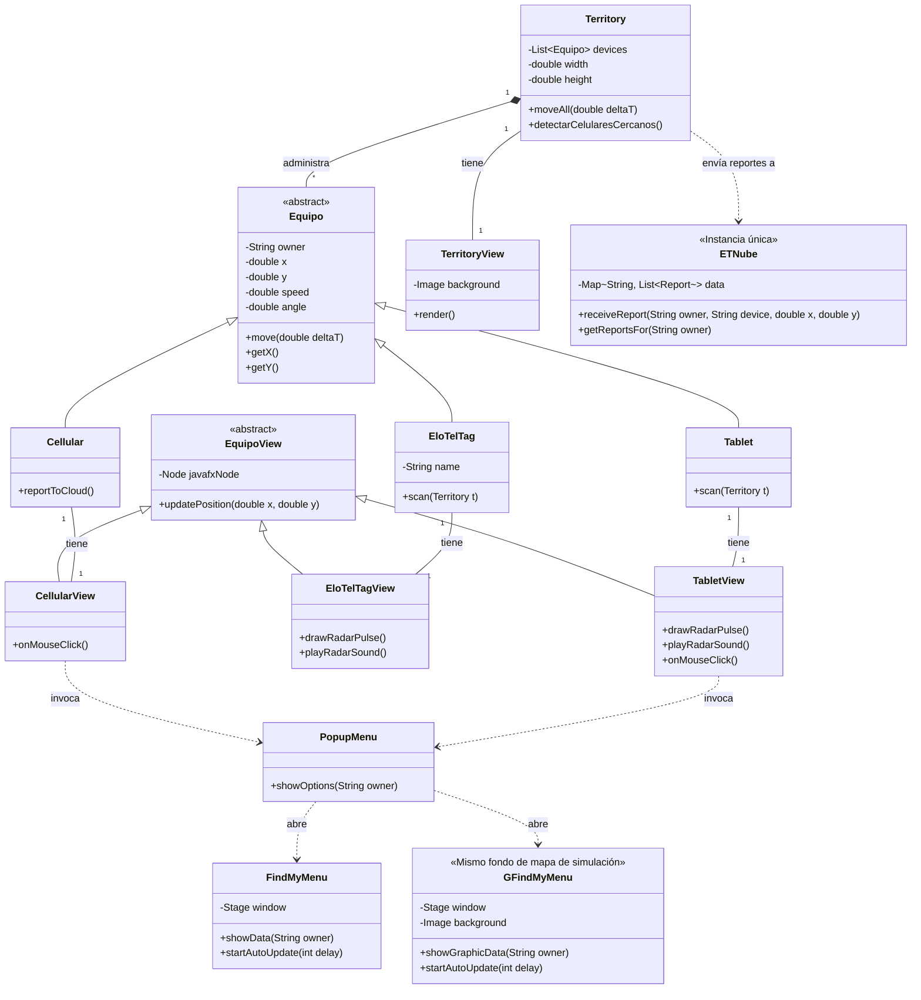

# Tarea_ELO329_T2

## Integrantes:
- Martin Layseca
- Diego Villanueva
- Joaquin Torres
- Eduardo Canales

# Simulador EloTelTag - Tarea 2

## Archivos de la Tarea (Etapa 4)
* **Código Fuente (`src/main/java/`):**
    * `Launcher.java`: Clase principal para iniciar la aplicación sorteando restricciones de módulos de JavaFX.
    * `Stage4.java`: Configura la ventana principal, el menú y lee el archivo de configuración.
    * `Territory.java` / `TerritoryView.java`: Clases para la lógica y representación gráfica del mapa (Modelo y Vista).
    * `Equipo.java`: Superclase que define las propiedades físicas comunes (x, y, velocidad).
    * `Cellular.java`, `EloTelTag.java`, `Tablet.java`: Clases que heredan de `Equipo` (Modelo).
    * `CellularView.java`, `EloTelTagView.java`, `TabletView.java`: Clases que representan gráficamente a los equipos (Vista) y manejan las animaciones de radar y sonido.
    * `ETNube.java`: Simula la base de datos o servidor en la nube para el registro de posiciones de los dispositivos detectados.
* **Archivos de Configuración y Recursos:**
    * `pom.xml`: Archivo de configuración de Maven para la gestión de dependencias (JavaFX y javafx-media).
    * `config.txt`: Archivo de texto con los parámetros iniciales de la simulación.
    * `Makefile`: Script para automatizar la compilación, ejecución y generación de Javadoc.
    * `src/main/resources/sonidos/`: Directorio que contiene el archivo de audio para el radar.

## Cómo compilar y ejecutar la tarea

El proyecto está configurado para ejecutarse fácilmente delegando el proceso a Maven, dependiendo de su entorno de trabajo. 

### Opción A: Entornos Linux / Ubuntu
Abra la terminal en el directorio raíz del proyecto y utilice los siguientes comandos proporcionados por el `Makefile`:
* **Para compilar y ejecutar la simulación:**
  ```bash
  make clean
  make
  make run
  ```

### Opción B: Entornos Windows (PowerShell)
Abra su consola PowerShell en la raíz del proyecto y ejecute el Wrapper de Maven:
   ```bash
   .\mvnw.cmd clean compile exec:java '-Dexec.mainClass=Stage4'
   ```
### Opción C: Utilizar IntelliJ
Abra el proyecto en la aplicacion, navegar a la clase `Launcher` y ejecutarla (Run 'Launcher.main()').

## Generación de Documentación (Javadoc)

Este proyecto está configurado para generar automáticamente la documentación técnica del código fuente utilizando Javadoc a través de Maven.

Para generar la documentación, siga estos pasos:
1. Abra una terminal en el directorio del proyecto.
2. Ejecute el comando: `make javadoc` (o alternativamente, ejecute `mvn javadoc:javadoc`).
3. El proceso creará una nueva carpeta llamada `target` (si no existía previamente).
4. Para visualizar la documentación, navegue a la ruta `target/reports/apidocs/` y abra el archivo `index.html` en su navegador web de preferencia.


## Diagrama de clases:


